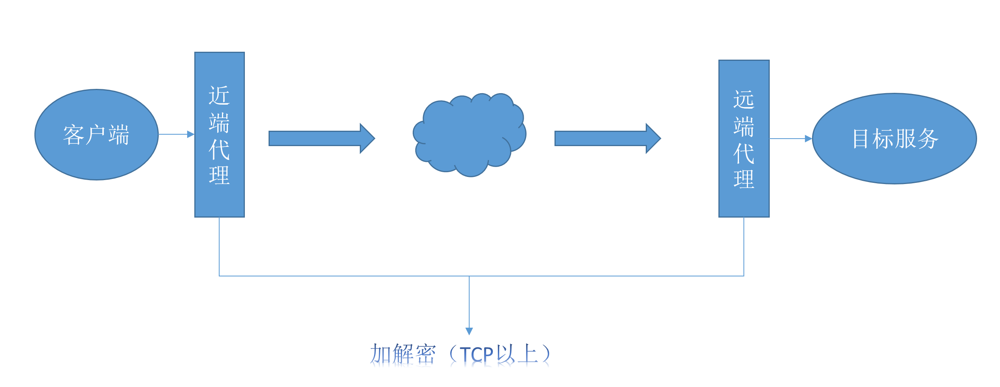

# 代代理-近端和远端双重代理模式

---
## 项目简介
名字没有错误，就是代代理。

通常我们使用的代理服务的网络模型是：客户端--->代理服务--->目标服务。

本软件的代理服务的网络模型是：客户端->近端代理-------->远端代理->目标服务。

其中近端代理可运行在本地或稍近一些的服务器，远端代理运行在靠近目标服务的区域。

采用这种双重代理的原因是为了保证在近端代理与远端代理之间数据传输的绝对安全和可控。
从网络传输层TCP开始，上层协议和数据的全部随机加密，并额外填充随机数据，从而保证从近端代理到远端代理之间的数据内容和协议格式的安全。



---
## 功能
1. 近端代理启动时可自动修改本地windows的代理配置，并指定使用pac或全局；
2. 近端代理支持http、socks4和socks5三种代理方式，其中http代理不用考虑DNS劫持问题；
3. 支持开启近端代理与远端代理的连接池管理（默认关闭），通常情况下，由于近端和远端距离远，延迟大，开启连接池能够避免近端与远端建立TCP连接时的时间损耗；
4. 近端代理与远端代理之间的数据传输协议为自定义且加密，并填充随机数据，保证数据内容的安全性同时避免数据特征检测；
5. 近端代理与远端代理之间的关系可以看做客户端与服务器的关系，近端代理在启动时向远端代理发起认证连接，认证成功后远端代理分配id和密钥，后续数据交互通过该密钥进行；

---

## 代理流程
假设近端代理在客户端本地运行
1. 近端代理启动，携带用户名密码（加密并随机添加数据）向远端代理服务的认证端口进行连接与认证；
2. 认证成功后，远端代理生成随机密钥、id，返回密钥、id和数据传输端口到近端代理；
3. 近端代理接收认证成功信息后，开启操作系统的代理功能（支持windows，pac或全局）;
4. 等待客户端应用发起的网络连接；
5. 收到客户端连接，将id、目标地址和端口信息加密发送给远端代理，远端代理尝试连接，返回连接结果；
6. 目标连接成功后，继续接收客户端发送的应用数据，使用远端代理分配的密钥加密（AES/ECB/PKCS5Padding），发送到远端代理；
7. 远端代理收到数据后，解密，转发给目标服务；
8. 目标服务返回数据，远端代理加密，发送给近端代理；
9. 近端代理解密，转发给相应的客户端应用；

---
## 部署
本项目中的proximal为近端代理，distal为远端代理，proximal与distal的关系为多对一。

---
### 远端代理的部署(以linux centos举例)
1. 使用一台服务器部署远端代理，如公司总部、海外云等，该服务器必须拥有公网IP或者被拥有公网IP的网络设备映射；
2. 从Releases下载distal的部署包或者自己拉代码本地构建；
3. 将部署包上传到服务器后，解压；
````
unzip distal.zip 
````
4. 修改application.properties配置文件，若不需要修改端口，则保留原有配置
````
#认证端口
proxy.auth.port=9110
#数据传输端口
proxy.proxy.port=9111
#认证过程中加密使用的密钥，近端和远端代理软件中存在默认密钥，可不配置
#auth.secret=abc.123.!@#
````
5. 修改user.properties，该配置文件中配置的是近端代理进行认证时使用的用户名和密码，根据需求修改；
````
#示例，其中的aaa是用户名，222是密码，可添加多个用户
aaa=222
````
6. 保证服务器运行环境上已安装JDK（1.8以上）；
````
java -version
````
若没有安装，则使用如下命令进行安装
````
yum install -y java-1.8.0-openjdk*
````
7. 运行启动脚本
````
sh bin/start.sh
````
8. 查看运行日志
````
tail -100f logs/stdout.log
````
正常打印如下日志，代表启动成功
````
Auth Server is running on /0.0.0.0:9110
Proxy distal Server is running on /0.0.0.0:9111
````
---
### 近端代理的部署（以windows举例）
1. 近端代理建议在运行在本地操作系统；
2. 下载proximal.jar的运行程序；
3. 本地环境需要安装java1.8以上；
4. 使用压缩软件打开并修改proximal.jar中的配置文件application.properties；
````
#近端代理启动的代理端口，在客户端上设置该端口为代理服务的端口
proxy.server.port=9109
#远端代理的地址和认证端口，替换为真实远端代理地址
proxy.distal.address=10.10.10.10
proxy.distal.auth.port=9110
#认证过程中加密使用的密钥，近端和远端代理软件中存在默认密钥，可不配置
#auth.secret=abc.123.!@#
#认证所使用的用户名和密码，表示proximal的身份，对应distal中的user.properties配置
proxy.username=aaa
proxy.password=222
#web服务的端口，该服务提供pac文件访问功能
server.port=9999
#是否使用连接池，默认为否
connection.pool.use=true
#max pool
connection.pool.max=50
#min pool
connection.pool.min=20
````
5. 若使用pac，则修改pac/1.pac脚本(不了解pac，则使用全局模式运行即可)
````
#若本地运行proximal，则使用127.0.0.1，不需要修改，若proximal运行在其它设备上，则将127.0.0.1改为该设备的地址
#其中的PROXY表示使用http协议，如果使用socks协议（windows系统自带的socks版本为4），修改PROXY为SOCKS
var proxy = "PROXY 127.0.0.1:9109";
````
6. 运行近端代理服务
````
#进入proximal.jar所在目录的cmd命令窗口
#全局模式
java -jar proximal.jar
````
````
#pac模式
java -jar proximal.jar pac
````
7. 查看运行日志，是否与远端代理连接并认证成功
````
start auth with distal server
auth distal x.x.x.x:9110
receive distal auth response, connectPort:9111, id:-837146, token:67F8C4DE7FB85175BCD519A2BC4FBAE7
auth to distal success!
````
#### 注意事项
关闭近端代理。建议使用Ctrl+c来关闭cmd窗口运行的程序，而不能直接关闭cmd窗口。原因是因为在本地启动代理服务后，自动修改了windows代理配置（设置->网络->代理），
若正确关闭代理服务，则服务在关闭之前会将系统代理还原。如未正确关闭代理服务，需要手动进入设置->网络->代理中关闭代理，不然则无法正常上网。
   
   